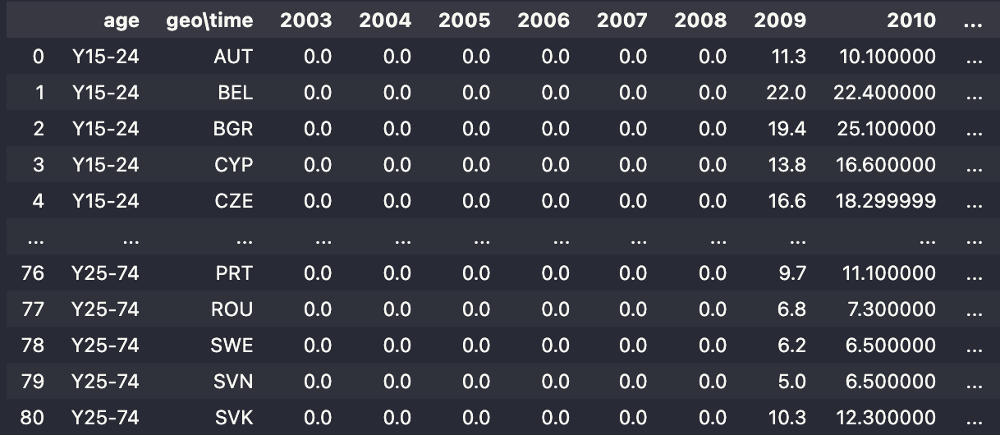
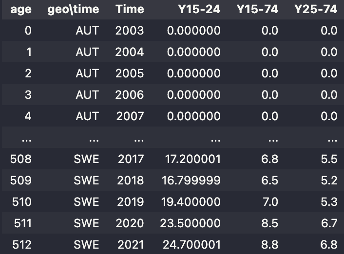

# Digital Twin of Society in Dash

## Environment

To run the application, the necessary packages have to be installed via conda with the following command:  
`$ conda env create -f environment.yml`

## Dash app

After the environment is installed successfully you can start the Dash app.

`$ python app.py`

You can access the application in your browser at `127.0.0.1:8050`.

## Uploading files

Currently you are able to upload CSV and TSV files. You must also specify the separator used in your dataset.  
After successfully uploading a dataset you can select the columns of interest for each required dropdown.

## Dropdowns

`Geo column` - specify the column that contains geographical/location-based data   
`Time column` - specify the column that contains timestamps   
`Feature column` - specify the feature of interest 

## Demo mode

If you do not have any datasets, you can load predefined datasets by pressing the `DEMO` button. After successfully loading these, you may set the last remaining dropdowns that you are interested in.

## Reshaping data

The most common format for time series has a row of data for each observation and a column for each observed feature.  
If you are dealing with datasets similar to datasets provided by EuroStat (rows indicate observed feature, columns indicate observation),  
you must use the reshape function. Here you should select the column that contains all of the observed features.  

&rarr;

## Forecasting

If you want to use the forecasting feature, you must specify the frequency of the observations in your data and the model you would like to use. For example, if your data has observations that were recorded yearly, you are required to set the time frequency to `Yearly`. Currently you can use the [Prophet](https://facebook.github.io/prophet/) model or a standard linear regression.  You can adjust the amount of future predictions by using the appropriate slider. Note that these future predictions are made in the same time frequency as the original data. 

## Presets

You can save a preset for preselected dropdown values by using the `EXPORT` button. This file can then be uploaded again using the `IMPORT` button to restore the selected dropdowns saved to the file.